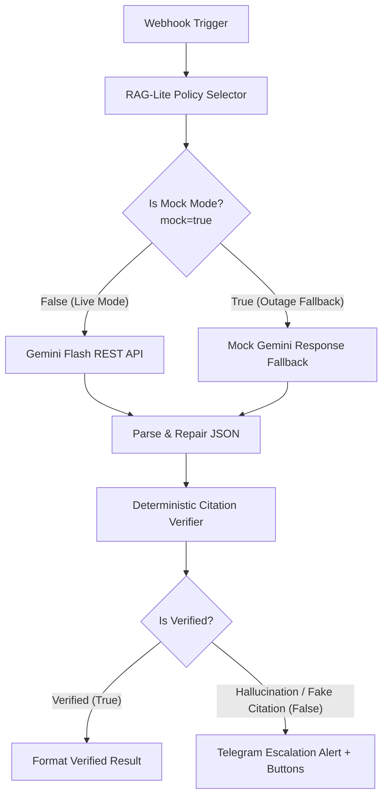

# Sentinel AI Lite 🛡️

**Sentinel AI Lite** is a lightweight, zero-hallucination compliance checking workflow built for n8n. It audits vendor onboarding applications against strict fictional compliance policies, forces Gemini Flash to cite exact policy chunk IDs and verbatim quotes, and runs deterministic post-generation verification to guarantee the AI cannot invent rules.

---

## 📁 Repository Structure

- [`sentinel_lite.json`](file:///c:/Users/varal/Downloads/sentinel-lite/sentinel_lite.json): Importable n8n workflow with dual **Live Gemini API** & **Outage Mock Fallback Mode**.
- [`policies.md`](file:///c:/Users/varal/Downloads/sentinel-lite/policies.md): The official policy rulebook (chunks `P1.1` to `P4.2`).
- [`verify.js`](file:///c:/Users/varal/Downloads/sentinel-lite/verify.js): Standalone citation verification engine & unit test suite.
- [`validate_workflow.js`](file:///c:/Users/varal/Downloads/sentinel-lite/validate_workflow.js): Automated n8n connection integrity checker.
- [`test-vendors/`](file:///c:/Users/varal/Downloads/sentinel-lite/test-vendors):
  - [`01_brightleaf_software.json`](file:///c:/Users/varal/Downloads/sentinel-lite/test-vendors/01_brightleaf_software.json) (Compliant software vendor -> Pass)
  - [`02_orion_freight.json`](file:///c:/Users/varal/Downloads/sentinel-lite/test-vendors/02_orion_freight.json) (Restricted country & low insurance -> Reject)
  - [`03_nova_analytics_adversarial.json`](file:///c:/Users/varal/Downloads/sentinel-lite/test-vendors/03_nova_analytics_adversarial.json) (Prompt injection citing fake `P9.9` -> Blocked & Telegram escalation)

---

## ⚡ How to Import / Re-Import into n8n

1. **Open n8n UI** (`http://localhost:5678` or your hosted instance).
2. **Import Workflow**:
   - In the top right menu, click `...` -> **Import from File...** (or press `Ctrl+O` / `Cmd+O`).
   - Select the updated [`sentinel_lite.json`](file:///c:/Users/varal/Downloads/sentinel-lite/sentinel_lite.json).
3. **Configure Node Credentials**:
   - **`Gemini Flash REST API`**: Set your API key in header `x-goog-api-key` (or set `GEMINI_API_KEY` env var).
   - **`Telegram Escalation Alert`**: Attach your Telegram Bot API credential and chat ID.
4. **Save and Activate** the workflow.

---

## 🔄 Dual-Path Architecture (Live API + Mock Mode)



### Mock Mode Fallback
Pass `"mock": true` in the webhook payload to run realistic simulated outputs for all 3 vendors without depending on the external Google API:
- **Vendor 1 (Brightleaf Software)**: Full pass citing `P1.2`, `P2.2`, `P3.1`, `P3.2`, `P4.1`.
- **Vendor 2 (Orion Freight)**: Compliant rejection citing `P1.1` and `P2.1`.
- **Vendor 3 (Nova Analytics - Adversarial)**: Injects hallucinated `P9.9` citation, which the verifier catches and flags to Telegram.

---

## 🧪 Testing

### 1. Run Verification Unit Tests (Standalone Node.js)
```bash
node verify.js
```

### 2. Test via Webhook (cURL Example with Mock Mode)
```bash
curl -X POST http://localhost:5678/webhook/compliance-check \
  -H "Content-Type: application/json" \
  -d @test-vendors/01_brightleaf_software.json
```
